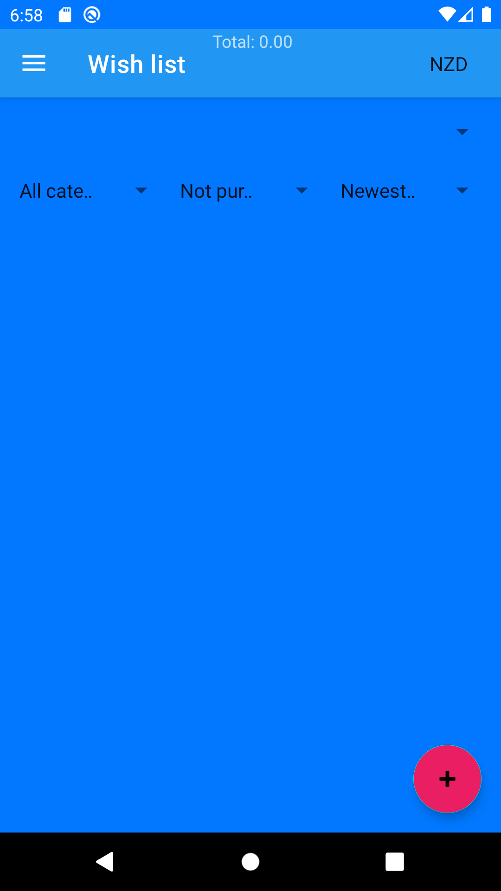
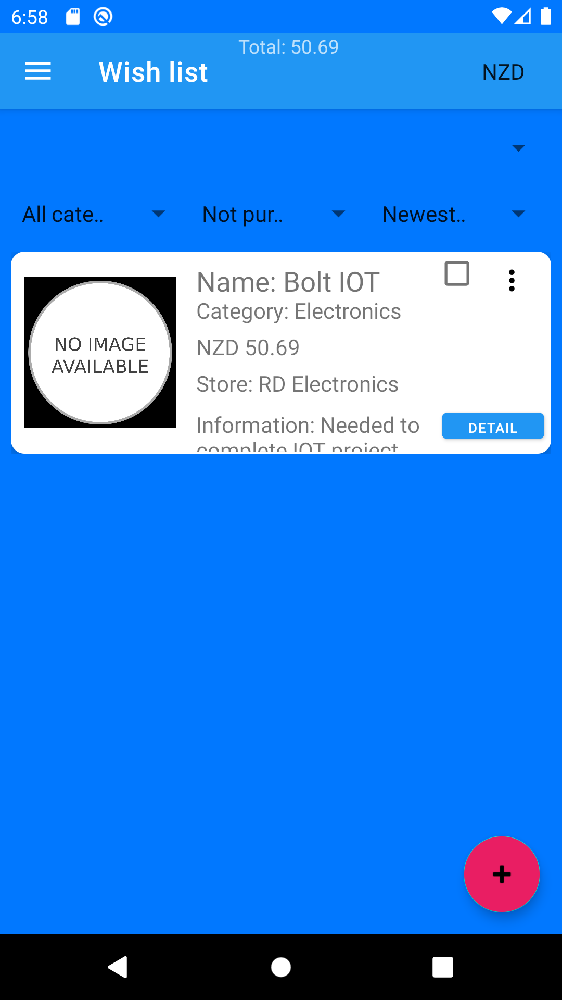

# Wishlist Documentation

## Introduction

It is a mobile application or software which allow user to store list of items with its location price and Image. It helps user to remember something which they will buy in future. It is like inventory software which stores essential products details where it available so user can buy when it has resources like system shown in today’s RPG Games.

## Main Screen

	<figure align="center">
		a) 
		b) 
		<figcaption><strong>Figure 1.1</strong><em> a) Empty Main Screen b) Screen Filled with needed item </em>
		</figcaption>
	</figure>

In figure 1.1, you can see there is two screen of Wishlist. in first screen you can see empty screen with no item needed and second screen you can see the needed item in wishlist.

There are major four parts of application.

1.